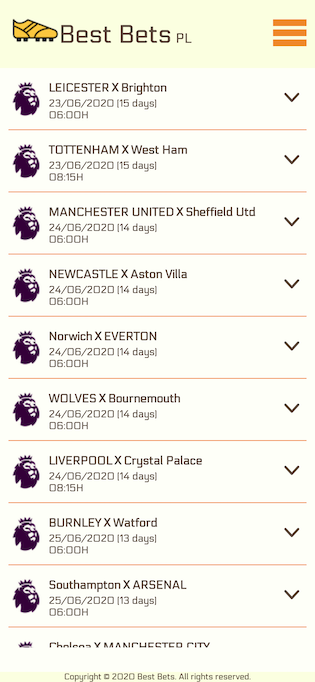
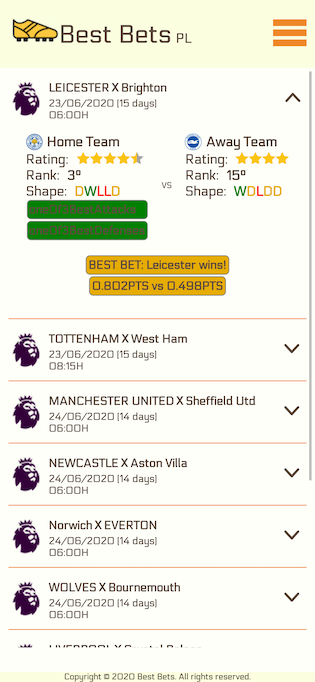

# BestBets App

BestBets App uses NextJS to give you an ultra fast app.

It uses data from [RapidApi](https://rapidapi.com/).

### Iphone X Screenshot

### How to run

Create a `.env.local` file at your route folder and set `NEXT_PUBLIC_MOCKED_DATA` to `true` if you want to run with mock data
or add a `RAPIDAPI_KEY` to run with real data. Run `yarn dev`to start the app in dev mode.

### Contributions

Contributions are welcome :-) Just open a PR and feel free to contact me.