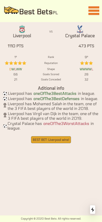

# BestBets App

BestBets uses NextJS to give you an ultra fast app!
It was developed using a mobile-first approach!

It uses data from [RapidApi](https://rapidapi.com/).

Demo [here](https://best-bets.vercel.app/).

### Iphone X Screenshot

### How to run

Create a `.env.local` file at your route folder and set `NEXT_PUBLIC_MOCKED_DATA` to `true` if you want to run with mock data
or add a `RAPIDAPI_KEY` to run with real data. Run `yarn dev`to start the app in dev mode.

### Contributions

Contributions are welcome. Just open a PR and feel free to contact me :-).

### TODO

#### Algorithm
- Players with more goals
- Evaluate sequences on shape DWW != WDW

#### Arquitectural
- Move data to DB
- Find team by name method strategy. (use alias)...

#### Others
- Best bet on front page
- Update react import 

#### UI
- Improve!!!! Special for desktop!!!